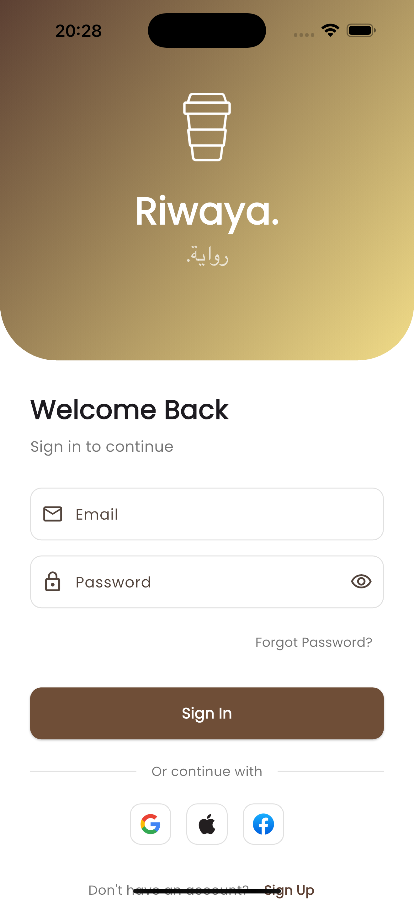
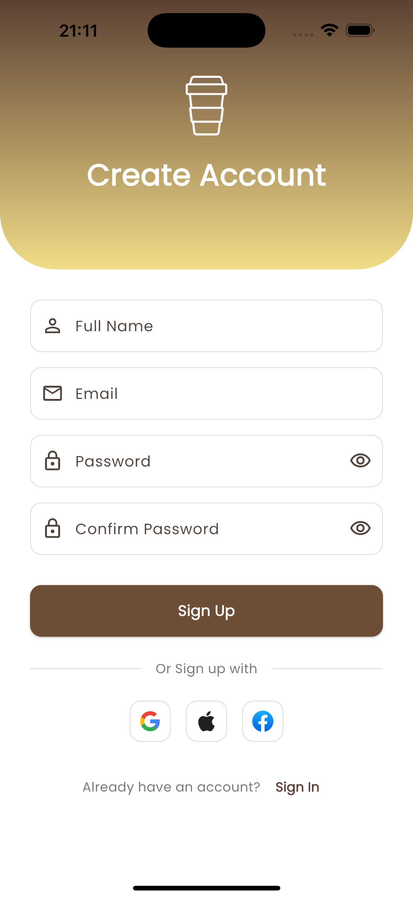
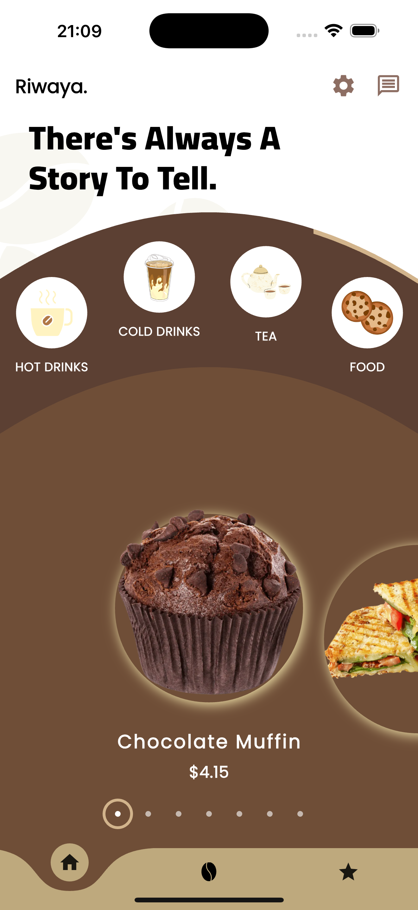
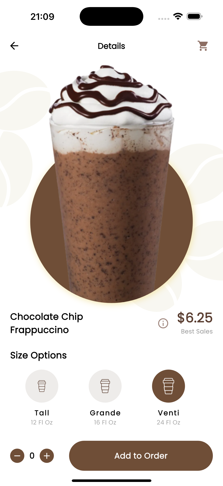
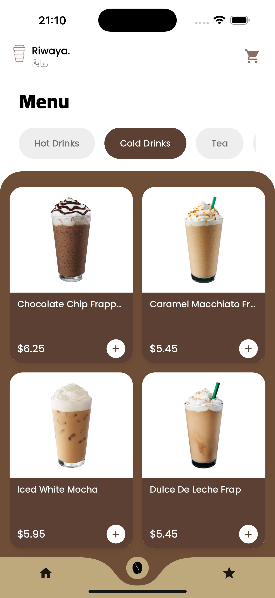
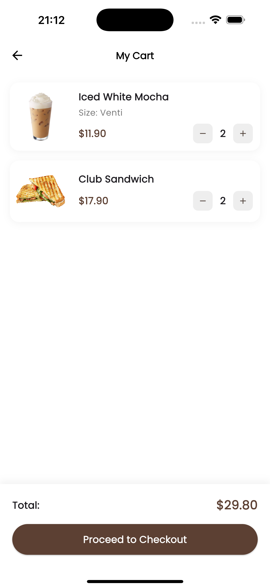
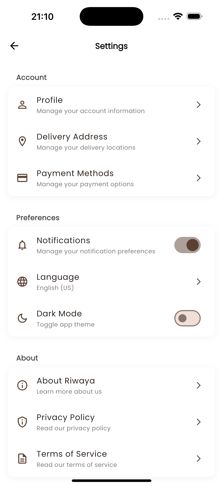
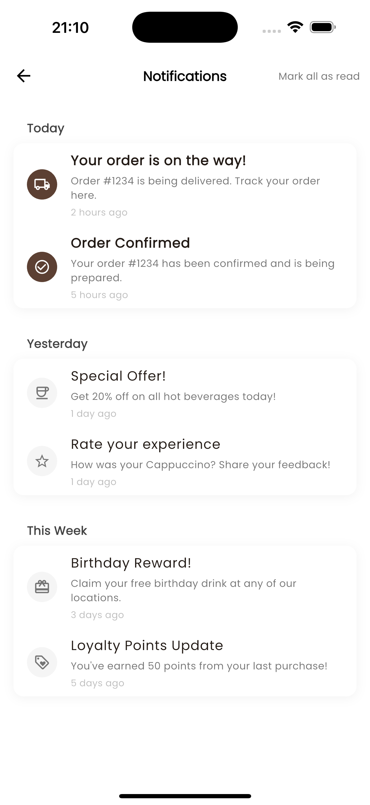
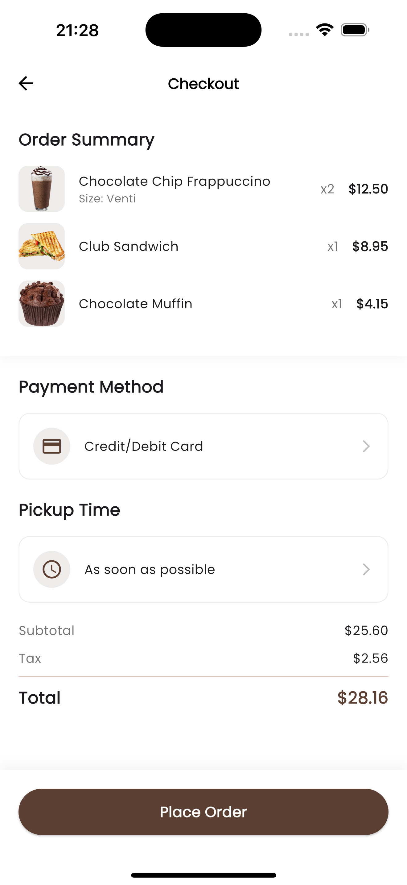
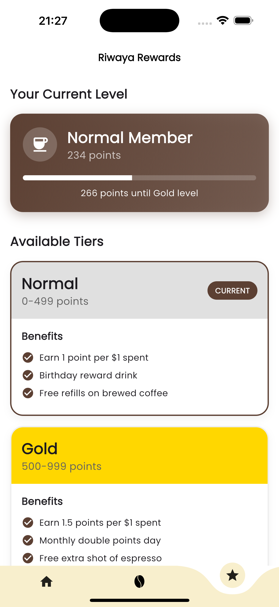

# Riwaya - Modern Coffee Shop App

A sleek and modern coffee shop mobile application built with Flutter, offering an immersive coffee ordering experience with features like size customization, rewards program, and a seamless ordering system.

## Features

☕ **Advanced Coffee Ordering**

- Drink categorization (Hot/Cold/Tea/Food)
- Size customization system
- Detailed product views with nutritional info
- Cart management
- Quantity controls
- Order customization

🏆 **Rewards Program**

- Tiered membership system (Normal/Gold/Platinum/Diamond)
- Points accumulation
- Level-based benefits
- Progress tracking
- Special member rewards

👤 **User Management**

- Secure authentication system
- Profile management
- Order history
- Rewards tracking
- Notification center

🎨 **Modern UI/UX**

- Elegant animations
- Custom curved designs
- Interactive product showcase
- Intuitive navigation
- Responsive layout

## Technical Stack

### Frontend

- Flutter for cross-platform development
- GetX for state management
- Custom widgets and animations
- Custom clippers for unique designs
- Image handling and hero animations

### State Management

- GetX controllers
- Reactive state updates
- Dependency injection
- Navigation management

## Getting Started

### Prerequisites

- Flutter (latest version)
- Dart SDK
- Android Studio / VS Code
- Git

### Installation

1. Clone the repository

```bash
git clone https://github.com/joewrdd/Riwaya.git
```

2. Install dependencies

```bash
cd riwaya.
flutter pub get
```

3. Run the app

```bash
flutter run
```

## Project Structure

```
lib/
├── common/              # Shared widgets
│   ├── background.dart
│   ├── product_image.dart
│   └── size_option_item.dart
├── utils/
│   ├── constants/      # App constants
│   ├── custom/         # Custom designs
│   └── widgets/        # Reusable widgets
├── views/
│   ├── app/           # Main app screens
│   │   ├── screens/   # App screens
│   │   └── controllers/ # GetX controllers
│   └── auth/          # Authentication
├── ui/                # UI models
└── main.dart         # Entry point
```

## Features in Detail

### Coffee Ordering Features

- Category-based browsing
- Size customization
- Quantity control
- Cart management
- Order customization

### Rewards Program

- Points system
- Tier benefits
- Progress tracking
- Special rewards
- Member exclusives

### User Features

- Email authentication
- Profile customization
- Order history
- Rewards tracking
- Notification management

## Screenshots

<div align="center">
  <div style="display: flex; flex-direction: column; align-items: center;">
    <!-- Login & Authentication -->
    <div style="flex: 2; padding: 10px;">
      <p><strong>Login & Authentication</strong></p>
      <div style="display: flex; gap: 10px;">
        
        
      </div>
    </div>
    <!-- Home & Product Details -->
    <div style="flex: 2; padding: 10px; margin-top: 20px;">
      <p><strong>Home & Product Details</strong></p>
      <div style="display: flex; gap: 10px;">
        
        
      </div>
    </div>
    <!-- Menu & Cart -->
    <div style="flex: 2; padding: 10px; margin-top: 20px;">
      <p><strong>Menu & Cart</strong></p>
      <div style="display: flex; gap: 10px;">
        
        
      </div>
    </div>
    <!-- Notification & Settings -->
    <div style="flex: 2; padding: 10px; margin-top: 20px;">
      <p><strong>Notification & Settings</strong></p>
      <div style="display: flex; gap: 10px;">
        
        
      </div>
    </div>
  </div>
  <!-- Subscription & Checkout -->
    <div style="flex: 2; padding: 10px; margin-top: 20px;">
      <p><strong>Subscription & Checkout</strong></p>
      <div style="display: flex; gap: 10px;">
        
        
      </div>
    </div>
  </div>
</div>

## Youtube Link For Demo Of The App

[Watch The Demo On YouTube](https://www.youtube.com/shorts/jx3vP4s0-Ew)

## Contributing

Contributions are welcome! Please feel free to submit a pull request.

## License

This project is licensed under the MIT License - see the LICENSE file for details.
